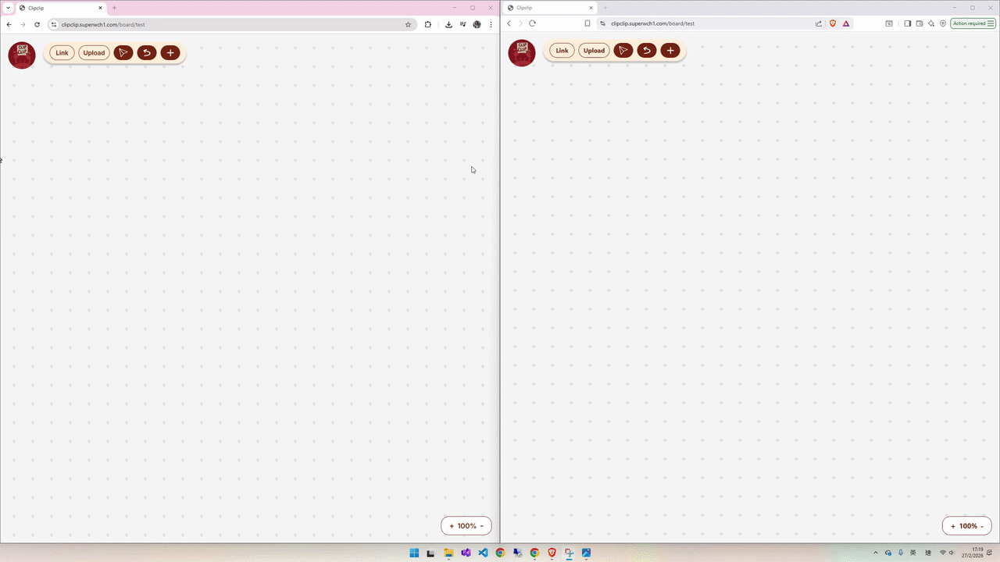
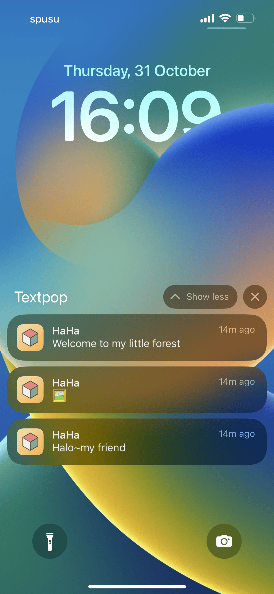
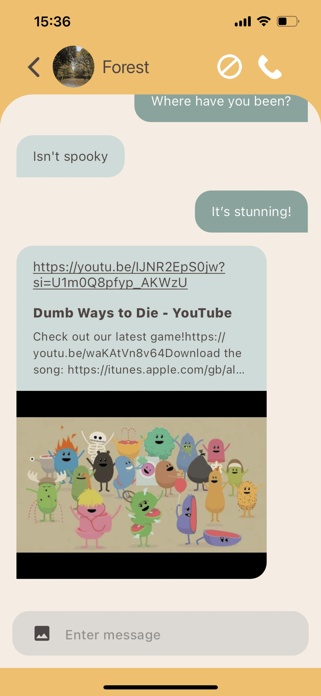
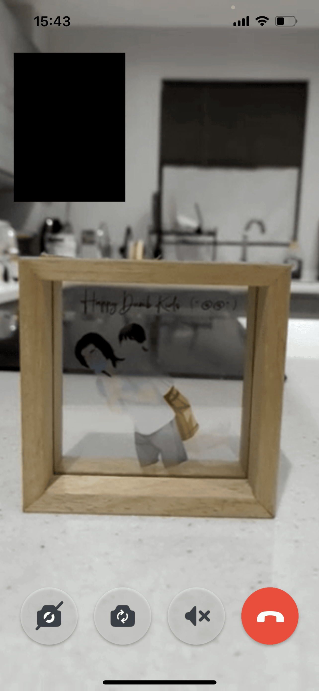
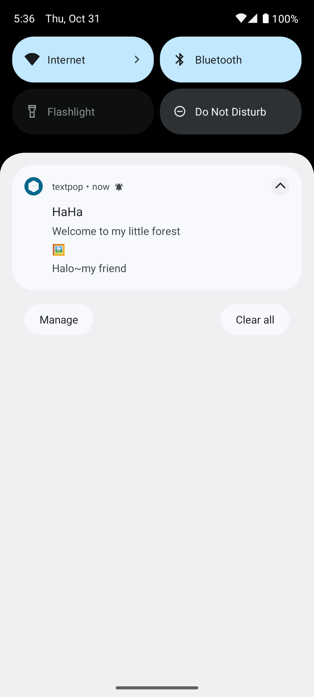

<h1>Hello, I'm John Wong</h1>
<h3>A passionate developer from United Kingdom</h3>

- 🌱 Currently learning **Docker**
- 👨‍💻 Love coding, cooking and playing squash

 
<h3>Languages</h3> 

<h3>Framework</h3> 

<h3>Technology</h3> 

 
<h3>Personal Project</h3> 
<h3>ItchyPatPat (Web) - Event serach and creation platform (Dec 2025 to now)</h3>

ASP.NET | Flutter | Postgres | OpenAI API | Azure Web App

Backend repo: Semantic search with ONNX, Magick.NET for image processing, Serilog for logging 
Frontend repo: page navigation with GoRouter, Maplibre with OpenStreetVector vector tile, JWT authenication  

<h3>JobsFinder <a href="https://ukjobsfinder.superwch1.com/">(Web) </a> - Job search platform (Mar to Jul 2025)</h3>

ASP.NET | Angular | SQL Server | Geocoding | Azure Virtual Machine

<a href="https://github.com/superwch1/ukjobs_server_public">Backend repo</a>: PlayWright for web scrapping (10,000 unique jobs per run), Unit test using Xunit and Moq 
<a href="https://github.com/superwch1/ukjobs">Frontend repo</a>: Displayed vacancy on integrated OpenStreetMap, Responsive Design for mobile, tablet and desktop  
 

<h3>ClipClip <a href="https://clipclip.superwch1.com/board/uk">(Web) </a> - Real time collaboration whiteboard (Apr to Sep 2024)</h3>

Express | React |  yjs (WebSocket) | MongoDb | Internet Information Services

<a href="https://github.com/superwch1/clipclip_server">Backend repo</a>: iisnode for IIS deployment and real time collabration using yjs 
<a href="https://github.com/superwch1/clipclip">Frontend repo</a>: Real time collaborative editing across text, images and web embedded previews  
 

<h3>Textpop <a href="https://apps.apple.com/uy/app/textpop/id6463212790">(App Store)</a>, <a href="https://play.google.com/store/apps/details?id=com.wch.textpop.android">(Play Store)</a> - Messaging with text & video chat (Jul 2023 to Feb 2024)</h3>

ASP.NET | Flutter | SignalR | Firebase | SQL Server | Internet Information Services

<a href="https://github.com/superwch1/textpop_server_public">Backend repo</a>: nClam for virus scanning and real time messaging with SignalR 
<a href="https://github.com/superwch1/textpop_public">Frontend repo</a>: Push notification for iOS and Android, messaging support text, image and video chat  

  
  
  
    

  

